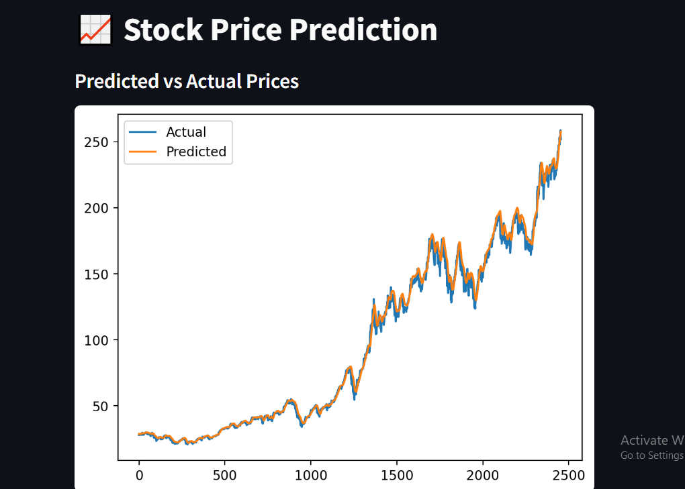

Absolutely! Here's a clean and professional `README.md` template for your **Stock Price Prediction using LSTM** project — perfect for your GitHub repo and resume portfolio.

---

## 📘 README.md — *Stock Price Prediction using LSTM*

```markdown
# 📈 Stock Price Prediction using LSTM

This project is a machine learning-based application that predicts future stock prices using a Long Short-Term Memory (LSTM) neural network. It also features an interactive Streamlit web app for visualizing actual vs predicted stock prices.

---

## 🚀 Features

- 💹 Predict stock prices based on historical data
- 📊 Visualize real vs predicted prices
- 🧠 Trained using LSTM (Recurrent Neural Network)
- 🛠️ Built with Python, Keras, Pandas, NumPy, Streamlit
- 📁 Jupyter Notebook for model training
- 🌐 Streamlit app for UI

---

## 📂 Project Structure

```
Stock-Price-Prediction/
│
├── app.py                     # Streamlit web app
├── stock_predictor.ipynb      # Jupyter Notebook (LSTM model training)
├── real_prices.npy            # Saved real prices (for plotting)
├── predicted_prices.npy       # Saved model predictions
├── venv/                      # Python virtual environment
└── README.md                  # This file
```

---

## 🧠 LSTM Model Overview

- Data Source: Yahoo Finance (`yfinance` library)
- Model: Sequential LSTM model using TensorFlow/Keras
- Input: 60-day window of past stock prices
- Output: Next day's predicted price
- Loss Function: Mean Squared Error (MSE)
- Optimizer: Adam

---

## ⚙️ Installation & Setup

1. **Clone the repo**
```bash
git clone https://github.com/yourusername/stock-price-prediction.git
cd stock-price-prediction
```

2. **Create virtual environment** (Python 3.10 recommended)
```bash
python -m venv venv
venv\Scripts\activate  # On Windows
# source venv/bin/activate  # On macOS/Linux
```

3. **Install dependencies**
```bash
pip install -r requirements.txt
```

4. **Run Streamlit app**
```bash
python -m streamlit run app.py
```

---

## 🧪 How to Train the Model

Open the `stock_predictor.ipynb` notebook in VS Code or JupyterLab. Run the cells to:

- Load stock data
- Preprocess and scale it
- Build and train the LSTM model
- Generate and save `real_prices.npy` and `predicted_prices.npy`

---

## 🖼️ Example Output

 

---

## 📦 Dependencies

- Python 3.10
- pandas
- numpy
- yfinance
- matplotlib
- scikit-learn
- tensorflow / keras
- streamlit

> Install everything with:  
```bash
pip install -r requirements.txt
```

---

## ✨ Future Improvements

- Add dynamic model training based on user-selected stocks
- Integrate more advanced models (e.g., ARIMA, Prophet)
- Deploy app online via Streamlit Cloud or HuggingFace Spaces

---

## 🙌 Acknowledgements

- Data from [Yahoo Finance](https://finance.yahoo.com/)
- Model inspiration from TensorFlow/Keras examples

---

## 📜 License

This project is licensed under the [MIT License](LICENSE).

```

---

Let me know your GitHub username or repo name and I can tweak the links too — or help you add a nice project image and `requirements.txt`. Want that?
